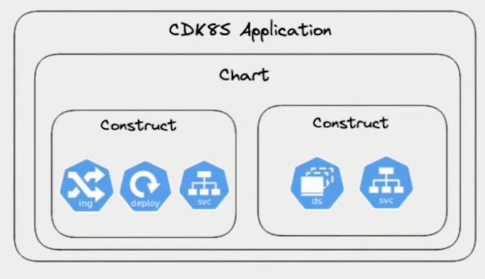
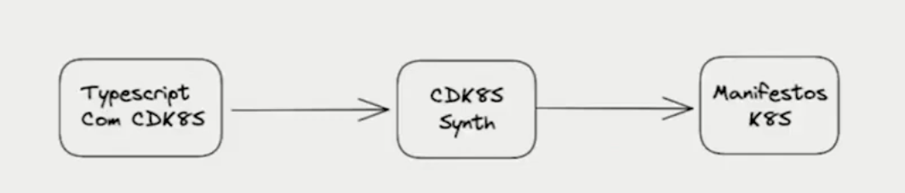

CDK - 
Cloud development kit da AWS
o maior cloud provider ja comecou construir building blocks para nos operadores da cloud para automatizar ainda mais ela

eles trouxeram de uma maneira bem simples, CDK acima da sigla criada pela AWS, traz tambem o conceito de de construir infraestrutura declarative, onde dizemos o que tem definido na nossa infra, quais valores, qual estado desejamos,  com linguagem de programacao como python, typescript, go, 

como funciona o CDK under the hood, https://github.com/aws/constructs

CDK8s extende esse conceito para gerar infraestrutura declarativa para K8s

define o conceito de Application e de chart
o chart fica dentro da aplicacao
entao a sua construct seria o menor bloco do CDK, e dentro dele vc tem a definicao de construct, 
e como podemos observar, alguns constructs recebem nomes especiais como, ingress, dplouyment, service, ou outro com deamon set e ingress, 
assim conseguimos empilhar nossa infraestrutura ate ter nossos charts e consequentemente nossos applications
 Eu vou mostrar mais na demo como ela de fato constroi nossa infra

basicamente, o que conseguimos entender
eu to usando typescript aqui, porque é a linguagem padrao do CDK e do CDK8s

Kdk8s 

ter um cluster de k8s 
instalar cdk8s via node 

npm install -g cdk8s-cli

criar um diretorio para criar sua app 

cdk8s init typescript-app dentro do diretorio vazio